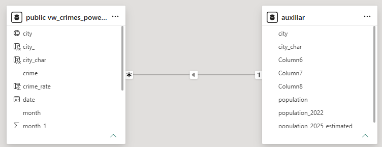

# Rio Grande do Sul Public Safety Data Analysis

## Overview

This project analyzes crime statistics across municipalities
in Rio Grande do Sul, Brazil, from 2016 to 2025.

The objective is to identify temporal, geographic and
behavioral patterns in crime statistics using Python,
SQL and Power BI.

## Business Questions

- How has crime evolved over time?
- Which municipalities account for the highest volume?
- Which crime categories show the strongest trends?
- Are there seasonal patterns?
- How does each municipality compare with the state average?

## Tools

- Python
- Pandas
- PostgreSQL
- SQL
- Power BI
- DAX
- Git/GitHub

## Data Pipeline

Excel → Python ETL → PostgreSQL → SQL → Power BI

ETL Challenge:  The data was downloaded from the Public Safety Secretariat of Rio Grande do Sul, Brazil [SSP/RS](https://www.ssp.rs.gov.br/indicadores-criminais). Because the original files had varying spreadsheet layouts and inconsistent header positions across different years, a Python/Pandas pipeline [crimes2.py](crimes2.py) was developed. This script automatically identifies the correct header row by locating the "Municípios" field, normalizes the monthly datasets, and consolidates the historical data. Following this automated consolidation, some remaining noise was manually cleaned using Excel. We also had 2 months that were not copied to the dataset that needed to be added manualy. The final, cleaned dataset is available in [crimes_RS_compilado](crimes_RS_compilado.xlsx).

In Postgre, a new database was created to better manipulate the data [create database and table.sql](sql/create%20database%20and%20table.sql). Other SQL queries were created in order to [clean and check](/sql/data_check_clean.sql), do a basic [data analisys](/SQL/data_analisys1.sql) and [organize data for power bi](sql/powerbi_view.sql)

In Power BI we also had to put a in order to pull the correct geographic match witht he maps downloaded form [IBGE website](https://www.ibge.gov.br/geociencias/organizacao-do-territorio/malhas-territoriais/15774-malhas.html?&t=downloads), this table was then inserted into Power BI data using relation

city with state and country information columns was also created to furfill the geographic match: 

Crime rate (occurrencies by 100000 habitants) was calculated inside Power BI query 

Now the data for Power BI looks like this:

## Key Skills Demonstrated

- Data cleaning
- ETL
- Data validation
- SQL
- Data modeling
- DAX
- KPI development
- Time-series analysis
- Geographic analysis
- Data visualization

## Dashboard

The dash board can 
## Key Findings

Overall recorded crime occurrences declined substantially over the period analyzed, with the most pronounced reduction occurring between 2023 and 2025.

Crime occurrences declined in 2020 compared with previous years, potentially reflecting the effects of the COVID-19 pandemic and the associated restrictions on mobility and social activity.

Robbery and theft also show a declining trend over the analyzed period. Possible contributing factors may include the increasing adoption of surveillance cameras in major cities, greater use of digital and social platforms, and the growing adoption of electronic payment methods. In contrast, fraud has increased significantly, suggesting a possible shift in the profile of reported criminal activity toward offenses involving digital and financial transactions.
