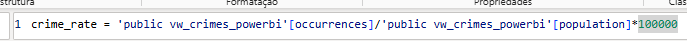
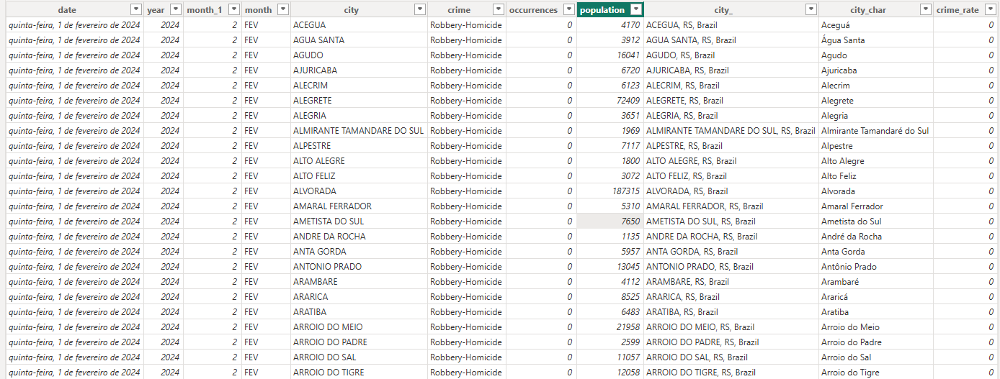
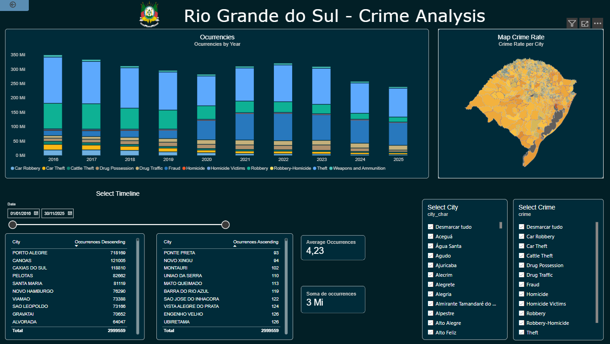

# Rio Grande do Sul Public Safety Data Analysis

## Overview

This project analyzes crime statistics across municipalities in
Rio Grande do Sul, Brazil, covering the period from 2016 to 2025.

The objective is to identify temporal and geographic patterns in
reported crime occurrences and transform raw public data into
actionable insights using Python, PostgreSQL, SQL, and Power BI.

The project covers the complete data analytics workflow:

**Data Collection → ETL → Data Validation → PostgreSQL → SQL Analysis → Data Modeling → Power BI**

---

## Business Questions

The analysis was designed to answer the following questions:

- How have crime occurrences evolved over time?
- Which municipalities account for the highest number of occurrences?
- Which crime categories show the strongest trends?
- Are there seasonal patterns in reported crime?
- How does each municipality compare with the state average?
- How do absolute crime occurrences compare with population-adjusted crime rates?

---

## Tools & Technologies

- Python
- Pandas
- PostgreSQL
- SQL
- Power BI
- DAX
- Git & GitHub

---

## Data Source

The crime statistics were obtained from the Public Safety Secretariat
of Rio Grande do Sul (SSP/RS).

[SSP/RS – Criminal Indicators](https://www.ssp.rs.gov.br/indicadores-criminais)

The dataset contains monthly crime statistics for 497 municipalities
covering January 2016 through December 2025.

---

## Data Pipeline

**Excel → Python ETL → PostgreSQL → SQL → Power BI**

### 1. Data Collection & ETL

The original data was provided as multiple Excel files containing
monthly crime statistics. The spreadsheet structure was not fully
consistent across different years, including variations in the
position of the header row.

To automate the consolidation process, a Python/Pandas ETL script
was developed:

[`crimes2.py`](crimes2.py)

The script:

- Identifies the correct header row by locating the `Municípios` field.
- Normalizes the structure of the monthly datasets.
- Consolidates the historical files into a single dataset.
- Standardizes column names and formats.

After the automated consolidation, some remaining data inconsistencies
were manually reviewed and corrected in Excel. Two missing monthly
records were also identified and manually added to the consolidated
dataset.

The final cleaned dataset is available here:

[`crimes_RS_compilado.xlsx`](crimes_RS_compilado.xlsx)

---

## 2. PostgreSQL

A PostgreSQL database was created to store and analyze the consolidated
dataset.

Database and table creation:

[`create database and table.sql`](sql/create%20database%20and%20table.sql)

SQL scripts were developed for data validation, cleaning, analysis,
and preparation for Power BI.

### Data Validation & Cleaning

[`data_check_clean.sql`](sql/data_check_clean.sql)

The validation process included checks for:

- Missing values
- Duplicate records
- Invalid values
- Date consistency
- Year/month consistency
- Municipality coverage
- Population consistency
- Monthly data completeness

### SQL Analysis

[`data_analisys1.sql`](SQL/data_analisys1.sql)

SQL queries were developed to analyze:

- Crime trends over time
- Municipality rankings
- Crime distribution
- Population-adjusted crime rates
- Temporal patterns

---

## 3. Power BI Data Preparation

A dedicated SQL view was created to organize the crime data for
Power BI:

[`powerbi_view.sql`](sql/powerbi_view.sql)

The original dataset contains multiple crime categories as separate
columns. For Power BI analysis, these categories were transformed
into a more flexible structure that allows users to dynamically
select one or multiple crime types.

The resulting structure includes fields such as:

- Date
- Year
- Month
- Municipality
- Crime Type
- Occurrences
- Population

This structure allows the dashboard to dynamically compare different
crime categories over time.

---

## 4. Geographic Analysis

Geographic analysis required additional preparation to ensure that
municipalities were correctly identified on the map.

Municipality boundary data from IBGE was incorporated into Power BI:

[IBGE – Territorial Boundaries](https://www.ibge.gov.br/geociencias/organizacao-do-territorio/malhas-territoriais/15774-malhas.html)

The geographic data was related to the crime dataset using municipality
identifiers.

Additional city, state, and country fields were created to improve
geographic matching and reduce ambiguity when displaying municipalities
on the Power BI map.


---

## 5. Crime Rate Calculation

In addition to absolute crime occurrences, population-adjusted crime
rates were calculated in Power BI.

The crime rate is expressed as:

**Crime Rate = (Crime Occurrences / Population) × 100,000**

This allows municipalities with different population sizes to be
compared using a common metric.



---

## Data Model

The final Power BI dataset is structured to support interactive
analysis by:

- Crime category
- Municipality
- Date
- Occurrences
- Crime rate



---

## Key Skills Demonstrated

- Data Collection
- Data Cleaning
- ETL Development
- Data Validation
- Python / Pandas
- PostgreSQL
- SQL
- Data Modeling
- DAX
- KPI Development
- Time-Series Analysis
- Geographic Analysis
- Crime Rate Analysis
- Data Visualization
- Power BI

---

## Dashboard

The Power BI dashboard provides an interactive view of crime
occurrences and crime rates across municipalities in Rio Grande do Sul.

Users can filter the analysis by:

- Crime category
- Municipality
- Time period

The dashboard includes:

- Crime occurrences by year
- Crime trends
- Municipality rankings
- Crime rates per 100,000 inhabitants
- Geographic distribution of crime rates
- Interactive crime and municipality filters



[Download the Power BI Dashboard](Power_BI/main.pbix)

---

## Key Findings

### Overall Trend

Recorded crime occurrences show a substantial decline over the
analyzed period, with a particularly pronounced reduction between
2023 and 2025.

### 2020

Crime occurrences declined in 2020 compared with previous years.
This period coincided with the COVID-19 pandemic and restrictions
on mobility and social activity, which may have influenced reported
crime patterns.

### Robbery and Theft

Robbery and theft show declining trends over the analyzed period.

These trends coincide with broader changes such as increased
surveillance infrastructure, greater adoption of digital services,
and changes in payment behavior. These factors should be considered
as hypotheses for further investigation rather than established
causes based solely on this dataset.

### Fraud

Fraud shows a significant increase over the analyzed period.

The increase coincides with the broader expansion of digital
communication and electronic financial transactions. Further analysis
would be required to determine whether changes in digital behavior,
reporting practices, or other factors contributed to this trend.

### Volume vs. Crime Rate

Municipalities with the highest absolute number of occurrences are
not necessarily the municipalities with the highest population-adjusted
crime rates.

This highlights the importance of analyzing both absolute occurrences
and rates per 100,000 inhabitants.

---

## Project Structure

```text
Rio-Grande-do-Sul-Public-Safety-Data-Analysis/
│
├── README.md
│
├── Python/
│   └── crimes2.py
│
├── SQL/
│   ├── create database and table.sql
│   ├── data_check_clean.sql
│   ├── data_analisys1.sql
│   └── powerbi_view.sql
│
├── Power_BI/
│   └── main.pbix
│
├── data/
│   └── crimes_RS_compilado.xlsx
│
└── images/
    ├── image-1.png
    ├── image-2.png
    ├── image-3.png
    ├── image-4.png
    └── image.png